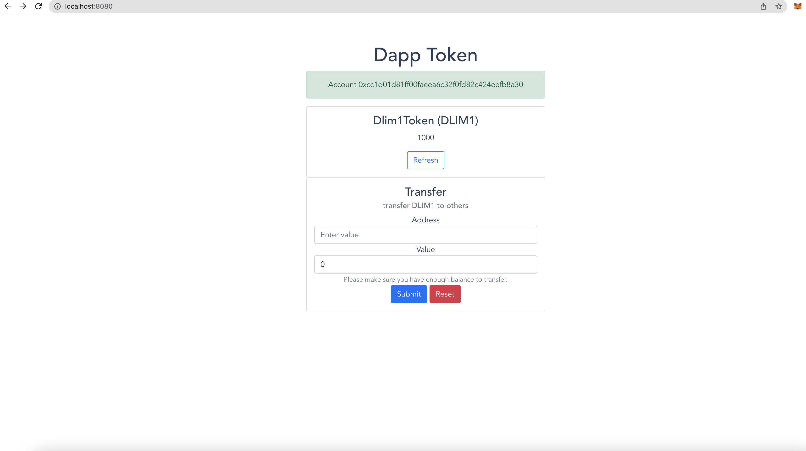

# Build a simple DAPP with your Own ETH Token

Adapted from [hardhat boilerplate](https://github.com/nomiclabs/hardhat-hackathon-boilerplate)

### Env values
- Values like API key and secrets should not be committed to repo
- Define the values as JSON in  `.env` and read them in `hardhat.config.js`

### Wallet 
- Use metamask

### Contract
- Create a new DLIM1 token on the Ropsten test network
- Extends ERC20 Token https://github.com/OpenZeppelin/openzeppelin-contracts/blob/8ef7655e7b515a30c8b11ffc8d78fbf44bb6fe24/docs/modules/ROOT/pages/erc20-supply.adoc
- https://ropsten.etherscan.io/address/0x0A1dC89F270881E7876D39D296D742381a5bB650

### Test
- `npx hardhat test`

### Deploy
- `npx hardhat run --network <network name> scripts/deploy.js`
- View contract at etherscan with the contract's address

### Frontend
- Vue application with ether.js
- 
